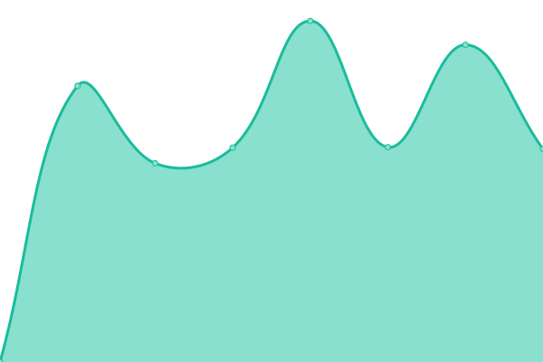
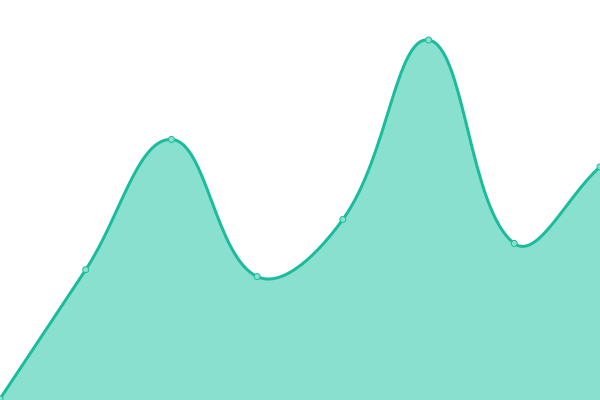

# [📈 Live Status](https://upptime.k92.gg): <!--live status--> **🟩 All systems operational**

This repository contains the open-source uptime monitor and status page for [Kyle Wong](https://kylewong.my), powered by [Upptime](https://github.com/upptime/upptime).

With [Upptime](https://upptime.js.org), you can get your own unlimited and free uptime monitor and status page, powered entirely by a GitHub repository. We use [Issues](https://github.com/y3owk1n/upptime/issues) as incident reports, [Actions](https://github.com/y3owk1n/upptime/actions) as uptime monitors, and [Pages](https://upptime.k92.gg) for the status page.

<!--start: status pages-->
<!-- This summary is generated by Upptime (https://github.com/upptime/upptime) -->
<!-- Do not edit this manually, your changes will be overwritten -->
<!-- prettier-ignore -->
| URL | Status | History | Response Time | Uptime |
| --- | ------ | ------- | ------------- | ------ |
|  Traworld | 🟩 Up | [traworld.yml](https://github.com/y3owk1n/upptime/commits/HEAD/history/traworld.yml) | 

 1374ms
     
 | 

<a href="https://upptime.k92.gg/history/traworld">100.00%</a>
    

|  Herlia | 🟩 Up | [herlia.yml](https://github.com/y3owk1n/upptime/commits/HEAD/history/herlia.yml) | 

 1258ms
     
 | 

<a href="https://upptime.k92.gg/history/herlia">100.00%</a>
    

|  Main MDA | 🟩 Up | [main-mda.yml](https://github.com/y3owk1n/upptime/commits/HEAD/history/main-mda.yml) | 

 1369ms
     
 | 

<a href="https://upptime.k92.gg/history/main-mda">100.00%</a>
    

|  Student MDA | 🟩 Up | [student-mda.yml](https://github.com/y3owk1n/upptime/commits/HEAD/history/student-mda.yml) | 

 371ms
     
 | 

<a href="https://upptime.k92.gg/history/student-mda">100.00%</a>
    

|  Admin MDA | 🟩 Up | [admin-mda.yml](https://github.com/y3owk1n/upptime/commits/HEAD/history/admin-mda.yml) | 

 220ms
     
 | 

<a href="https://upptime.k92.gg/history/admin-mda">100.00%</a>
    

|  Merchant MDA | 🟩 Up | [merchant-mda.yml](https://github.com/y3owk1n/upptime/commits/HEAD/history/merchant-mda.yml) | 

 315ms
     
 | 

<a href="https://upptime.k92.gg/history/merchant-mda">100.00%</a>
    

|  Instructor MDA | 🟩 Up | [instructor-mda.yml](https://github.com/y3owk1n/upptime/commits/HEAD/history/instructor-mda.yml) | 

 243ms
     
 | 

<a href="https://upptime.k92.gg/history/instructor-mda">100.00%</a>
    

<!--end: status pages-->

[**Visit our status website →**](https://upptime.k92.gg)

## 📄 License

- Powered by: [Upptime](https://github.com/upptime/upptime)
- Code: [MIT](./LICENSE) © [Kyle Wong](https://kylewong.my)
- Data in the `./history` directory: [Open Database License](https://opendatacommons.org/licenses/odbl/1-0/)
